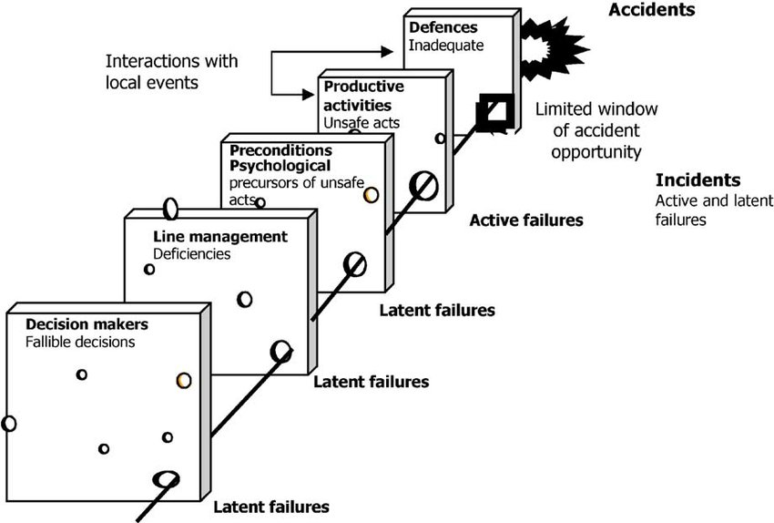

[home](https://disesdi.github.io/) | [about](https://disesdi.github.io/about.html) | <a href="https://github.com/disesdi/" target="_blank" rel="noopener noreferrer">code</a> | [contact](https://disesdi.github.io/contact.html)

# Safety Vs Security: Aviation Culture Meets Cyber

### By <a href="https://disesdi.github.io/contact.html" target="_blank" rel="noopener noreferrer">Disesdi</a> | *2022/10/15*

-------

*What’s The Difference Between Safety And Security?*

-------

## Introduction

In this post I’ll be talking about aviation safety culture, the Swiss Cheese Model, & data sharing. 

I’ll also 

* *tell you where you can find aviation safety datasets* 

* *talk about the interaction between safety and security,* and 

* *talk about how cybersecurity culture is complementary to aviation safety.*

Let’s go!

## A Culture Of Safety

Aviation has a well earned reputation as [the safest mode of transit](https://www.iata.org/en/youandiata/travelers/aviation-safety/#:~:text=Flying%20is%20the%20safest%20form,for%20every%204.2%20million%20flights.), with a track record that’s steadily getting better.[1] 

The focus on safety results in an environment that fosters transparency and information sharing. All this information sharing is done with one goal in mind: to ensure better safety for all parties involved. 

Sharing data is an important part of the process of safety improvement.

Aviation incidents are not routinely swept under the rug. Instead, after a thorough investigation, the community gathers for a kind of “debriefing” on what went wrong, and how it could have been prevented. 

Critically, the emphasis is not on placing blame, but rather on finding out the root causes of an incident so that similar problems can be prevented in the future.

## Data-Sharing Culture

For example, in the United States, the [Aviation Safety Reporting System (ASRS)](https://asrs.arc.nasa.gov/) is a confidential, voluntary, and importantly, *non-punitive* reporting system.[2]  Its goal is to collect information on aviation incidents, and use data analysis to make safety recommendations.

The ASRS is a program of the FAA, administered by NASA. The FAA similarly has a data-sharing platform of its own, called the [Aviation Safety Information Analysis and Sharing (ASIAS)](https://www.asias.faa.gov/apex/f?p=100:1::::::) system.[3] The platform [hosts data on accidents & incidents](https://www.asias.faa.gov/apex/f?p=100:2:::NO:::), plus ASRS data, and more.[4]  

The goal is to increase transparency and data sharing for aviation safety overall.

### More Sharing, More Safety

In spite of advances in digital avionics systems, in many ways the aviation and cybersecurity worlds have remained relatively separated in terms of information sharing. 

Expertise in aviation tends to be siloed & largely gained through experience. Meanwhile, cybersecurity knowledge is often similarly confined in industry circles. 

Integrating cybersecurity awareness in aviation means thinking of cybersecurity as another means to achieve, and continually improve on, safety itself. So maybe it’s best to think of security as a way to get to safety.

Not the only way. But an important one.

The issues involved in aviation cybersecurity are varied and complex. A couple of key factors driving the importance right now:

aircraft adopting more software-driven technologies
aviation-related tech becoming increasingly available to civilians

Wireless and E-Enabled aircraft technologies are among the newest software-enabled tech onboard modern commercial planes now. 

Manufacturers must design systems that comply with certification requirements. They have to provide for backups & redundancy. They must also ensure security of safety critical systems distinct from, say, systems for in-flight infotainment.

But the attack surface isn’t just limited to onboard software systems.

Many traditional communications technologies relied on security-through-obscurity or general unavailability to the general public for their security. 

This approach to security is becoming rapidly unstainable, as more and more aviation-related tech becomes increasingly available to civilians.

### An Evolving Threat Landscape

An example–that luckily didn’t result in tragedy–is the early 2021 arrest of a Berlin man who was [pretending to be Air Traffic Control, and attempting to direct air traffic](https://apnews.com/article/arrests-berlin-f56833f73c7ecfa34a5ed5e6461669bc) with a handheld radio.[5]  

It took police more than six months to apprehend him. Fortunately, aviation systems worked together in this case to prevent loss of life. But the ease with which the man was able to evade authorities gives pause.

If it was possible for a relatively unsophisticated actor to make contact with commercial aircraft, while evading law enforcement for months, what else is possible?

The cyber threat landscape is constantly evolving. (Cyber)security will continue to increase in importance in aviation, particularly as planes shed wires and increase connectivity.

The question of the moment is what can we do to improve security–and safety–as the aviation world becomes increasingly digital?

## How Does Safety Happen?

On one level, it’s easy to define what makes aviation so safe as a form of travel: there is the information sharing, the focus on safety and self reporting. There’s also teamwork among cabin crew, pilots, air traffic control, and other support systems. 

Systems like maintenance and engineering also play critical roles in keeping air travel safe. When all these work together, they help prevent incidents. 

With the tremendous number of people who directly or indirectly touch safety-critical aspects of each flight, the aviation industry is an incredible example of organization & teamwork. Given how vastly complex all these interconnected systems are, it’s amazing how well it works.

The complexity of the systems involved in global air transport can make it difficult to visualize how it all works together, safely. That’s where the Swiss Cheese Model comes in.

The [*Swiss Cheese Model*](https://www.ncbi.nlm.nih.gov/pmc/articles/PMC1117770/) is an example of how multiple safety systems might–or might not–work together. In the model, safety systems stack up like slices of swiss cheese. Each slice has “holes” symbolizing errors or another lack of defense, but the layering of all these systems in tandem works to *hopefully* make sure the “holes” never fully line up–and a serious incident never slips through.[6]  

Source: *["Repairs as the last orderly provided defense of safety in aviation"](https://blogs.helsinki.fi/iarminen/files/2010/09/Arminen-et-al.-2010.pdf)*[7]

The Swiss Cheese Model is a way of representing how systems can work together, preventing a critical incident from getting past the defenses. The model is a great example of how redundancy and teamwork in aviation play crucial roles in preventing mishaps.

The Swiss Cheese Model is also an example of *[layered security](https://www.ibm.com/docs/en/i/7.3?topic=security-layered-defense-approach)*.[8]  

Layered security is a method for preventing a single point-of-failure in critical systems. The idea goes like this: the more systems working together, the safer the general outcome. It is one of the security world’s versions of *redundancy*.

When there are many layers in a security system, there isn’t a single point where a failure becomes unrecoverable. For a critical breach to occur, multiple systems must fail in between.

Layered security works similarly to how safety is conceptualized in The Swiss Cheese Model: the deeper the layers, the greater the barrier to breach. In other words, more layers translate to a lower risk of a security incident.

## How Do Safety And Security Interact?

A simple way to conceptualize the interaction between the safety and security is to think of security as *a means to achieve* safety.

If you’ve ever traveled by air, you know that security is acknowledged as crucial everywhere in airports.  

Passengers in most airports around the world submit to multiple screenings and inspections before boarding commercial aircraft, because most governments and industry organizations recognize that security plays an important role in safety.

Securing air transport means defending against malicious attacks, including cyberattacks. Security is one puzzle piece in the overall safety picture.

Is security the only means to achieving safety? No, of course not. There are many other threats to safety that don’t come from malicious attacks. Weather, maintenance, & even pilots’ task saturation, can all play critical roles in flight safety.

But security can be–and often is–important to consider in the context of mission safety. The mission for civil aviation is a safe and uneventful flight for passengers, crew & the aircraft itself. 

Cybersecurity of critical control & support aviation systems plays an important role across all these vectors.

Paying attention to cybersecurity as a part of overall AvSec is complementary–and becoming more & more integral–to aviation safety.

-------

## [*Contact me >>*](https://disesdi.github.io/contact.html)

-------

## References

1. “Aviation Safety.” IATA, https://www.iata.org/en/youandiata/travelers/aviation-safety/. Accessed 22 October 2022.

2. Aviation Safety Reporting System: ASRS, https://asrs.arc.nasa.gov/. Accessed 22 October 2022.

3. FAA. “Faa Aviation Safety Information Analysis And Sharing (ASIAS) System.” https://www.asias.faa.gov/apex/f?p=100:1. Accessed 22 October 2022.

4. FAA. “Data & Information.” FAA  ASIAS, https://www.asias.faa.gov/apex/f?p=100:2:::NO. Accessed 22 October 2022.

5. “Berlin man caught directing flight traffic with radio.” AP News, 29 January 2021, https://apnews.com/article/arrests-berlin-f56833f73c7ecfa34a5ed5e6461669bc. Accessed 22 October 2022.

6. Reason, James (2000-03-18). "Human error: models and management". British Medical Journal. 320 (7237): 768–70. doi:10.1136/bmj.320.7237.768

7. Arminen, Ilkka, Petra Auvinen and Hannele Palukka. “Repairs as the last orderly provided defense of safety in aviation.” Journal of Pragmatics 42 (2010): 443-465.

8. IBM. “The layered defense approach to security.” IBM, https://www.ibm.com/docs/en/i/7.3?topic=security-layered-defense-approach. Accessed 22 October 2022.

-------
_______
