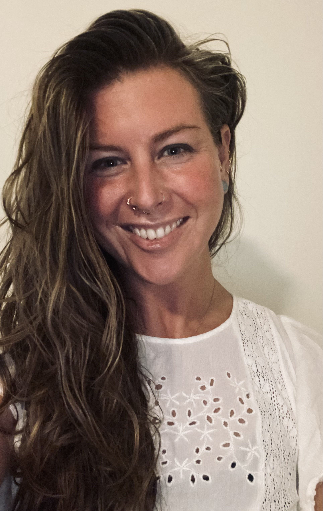

-------

**[Home](https://anglesofattack.io/) \| [Posts](https://anglesofattack.io/posts.html) \| [Papers](https://anglesofattack.io/papers.html) \| [Media](https://anglesofattack.io/media.html) \| About**

-------

# *Angles of Attack: About*

-------

**[Bio](#bio)** \| **[Services](#services)** \| **[Contact](#contact)** \| **<a href="https://disesdi.substack.com/" target="_blank" rel="noopener noreferrer">Newsletter</a>**

-------

-------

### Bio

Susanna Cox is an AI/ML Architect, Security Researcher & AI security patent holder with more than a decade of experience on the bleeding edge of AI security. Applying her passion for aerospace and safety-critical engineering to adversarial machine learning and AI/ML security operations, Susanna authored the industry’s first AI/MLSecOps paper, adapted game theoretic threat modeling from aerospace & defense for AI systems, and applied aerospace design assurance principles to production AI. As part of the OWASP AI Exchange Core Author team, Susanna also contributes to technical advisory for international engineering standards, requirements for the EU AI Act, and policy advisory for AI security stakeholders.

Susanna provides training in AI security and threat modeling for AI systems to C-suite, security, data, and dev teams, investors, and other stakeholders. As a consulting AI security architect, Susanna brings her experience in AI security R&D, threat modeling, and policy application to theoretical and applied challenges in research and industry.

Susanna curates AI security news, intel & insights at [anglesofattack.io](https://disesdi.substack.com/), and a newsletter with AI threat modeling & in-depth analysis at <a href="https://disesdi.substack.com/" target="_blank" rel="noopener noreferrer">disesdi.substack.com</a>.

-------

### Services

> * **AI security training** centered around AI threat modeling for Data, Security, C-Suite and investor teams. For diverse use cases including compliance, upskilling, and due diligence.

> * **Strategic AI security consulting** services including Architecture, Implementation, Research Design, and Product. Oriented around three areas of focus: Engineering Principles, Attack Surface & Defensive Capabilities (including R&D), and Policy/Application At Scale.

-------

<a href="https://calendar.app.google/MemzFXVuhz1upGE2A" target="_blank" rel="noopener noreferrer">Request a meeting >></a>

-------

### Contact

-------

> <a href="mailto:disesdi.susannacox@owasp.org" target="_blank" rel="noopener noreferrer">disesdi.susannacox@owasp.org</a>

> <a href="https://www.linkedin.com/in/disesdi/" target="_blank" rel="noopener noreferrer">in/disesdi</a>

> <a href="https://x.com/disesdi" target="_blank" rel="noopener noreferrer">x.com/disesdi</a>

> <a href="https://www.youtube.com/@disesdi" target="_blank" rel="noopener noreferrer">youtube.com/@disesdi</a>

> <a href="https://calendar.app.google/MemzFXVuhz1upGE2A" target="_blank" rel="noopener noreferrer">Calendar >></a>

-------

<a href="https://zenodo.org/search?q=metadata.creators.person_or_org.name%3A%22Cox%2C%20Susanna%22&l=list&p=1&s=10&sort=bestmatch" target="_blank" rel="noopener noreferrer">Zenodo</a> \| <a href="https://scholar.google.com/citations?hl=en&user=mRCXIV8AAAAJ" target="_blank" rel="noopener noreferrer">Google Scholar </a> \| <a href="https://orcid.org/0009-0003-0568-0236" target="_blank" rel="noopener noreferrer">ORCID </a> 

-------

**ᏗᎦᏙᎯ:** *Find out which Indigenous nation(s) lands <a href="https://native-land.ca/" target="_blank" rel="noopener noreferrer">you occupy here</a>*

-------

<a href="https://native-land.ca/" target="_blank" rel="noopener noreferrer">🕷</a>

