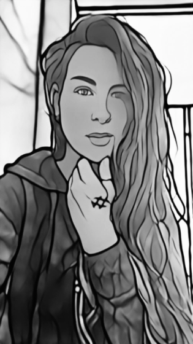

-------

**[Home](https://anglesofattack.io/) \| [Posts](https://anglesofattack.io/posts.html) \| [Papers](https://anglesofattack.io/papers.html) \| [Media](https://anglesofattack.io/media.html) \| About**

-------

# *Angles of Attack: About*

-------

**About** \| **[Bio](#bio)** \| **[Services](#services)** \| **[Contact](#contact)** \| **<a href="https://disesdi.substack.com/" target="_blank" rel="noopener noreferrer">Subscribe</a>**

-------

Consulting AI Security Researcher. Patent Holder. Policy & Standards Contributor. OWASP AI Exchange. Ex: Mathematician → Red Team Lead → AI Security Researcher → Data Scientist → AI Architect → CDO.

Coming soon \| AI Security Intel Brief: <a href="https://disesdi.substack.com/" target="_blank" rel="noopener noreferrer">disesdi.substack.com</a>.

-------

<a href="https://calendar.app.google/MemzFXVuhz1upGE2A" target="_blank" rel="noopener noreferrer">Request a meeting >></a>

-------

-------

### Bio

-------

Susanna Cox has spent her career on the bleeding edge of AI security. Applying her passion for aerospace and safety-critical engineering to adversarial machine learning and AI/ML security operations, Susanna authored the industry’s first AI/MLSecOps paper, adapted game theoretic threat modeling from aerospace & defense for AI systems, patented defense-grade data poisoning protection for the challenging federated AI attack surface, and applied aerospace design assurance principles to production AI. As part of the OWASP AI Exchange Core Author team, Susanna also contributes to technical advisory for international engineering standards, requirements for the EU AI Act, and policy advisory for AI security stakeholders.

As a Consulting Security Researcher, Susanna brings her experience in AI security R&D, threat modeling, and policy application to theoretical and applied challenges in research and industry. Susanna also provides training in AI security and threat modeling for AI systems to C-suite, security & data teams, investors, and other stakeholders. 

Susanna curates AI security news, intel & insights at [anglesofattack.io](https://disesdi.substack.com/), and (coming soon) a newsletter with AI threat modeling & in-depth analysis at <a href="https://disesdi.substack.com/" target="_blank" rel="noopener noreferrer">disesdi.substack.com</a>.

-------

### Services

-------

> **→ AI security training** *for Data teams, Security teams, C-Suite and Investors*
>
> **→ Strategic AI security consulting** *including AI Security Risk Assessment, Strategy, and Policy Advocacy*
>
> **→ R&D Support** *for design & implementation*

-------

> <a href="https://calendar.app.google/MemzFXVuhz1upGE2A" target="_blank" rel="noopener noreferrer">Request a meeting >></a>

-------

### Contact

-------

> <a href="mailto:disesdi.susannacox@owasp.org" target="_blank" rel="noopener noreferrer">disesdi.susannacox@owasp.org</a>
>
> <a href="https://www.linkedin.com/in/disesdi/" target="_blank" rel="noopener noreferrer">in/disesdi</a>
>
> <a href="https://x.com/disesdi" target="_blank" rel="noopener noreferrer">x.com/disesdi</a>
>
> <a href="https://www.youtube.com/@disesdi" target="_blank" rel="noopener noreferrer">youtube.com/@disesdi</a>

-------

**ᏗᎦᏙᎯ:** *Find out which Indigenous nation(s) lands <a href="https://native-land.ca/" target="_blank" rel="noopener noreferrer">you occupy here</a>*

-------

<a href="https://anglesofattack.io/about.html">🕷</a>

